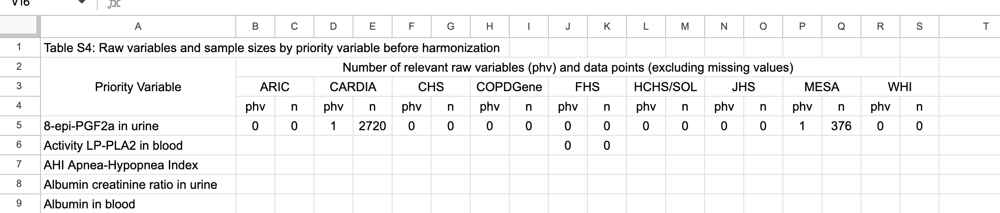

### Generate a report of pre-harmonized data counts by variable and phv, filtered to Corey's phv list
- The phv lists for each study are in `NHLBI-BDC-DMC-HV/transform_assessment/ valid-phvs`. Don't have lists (yet?) for ARIC, CARDIA, and MESA.
- data lives in [Export_BDCHM_noFHS-noCOPDGene_phv_mappings: Export_BDCHM_noFHS-noCOPDGene_p](https://docs.google.com/spreadsheets/d/1Fg6YFMldjDJWXTjFLJc4eVyXpOWeGoHJyg68i7u0LC4/edit?gid=1528582058#gid=1528582058)
- put in csv like this [Data Harmonization Supplementary Data](https://docs.google.com/spreadsheets/d/1PDaX266_H0haa0aabMYQ6UNtEKT5-ClMarP0FvNntN8/edit?gid=1605543644#gid=1605543644) Table S4
      
    - This template has merged cells and multiple header lines, which won't work in CSV. Instead, generate
        - A regular csv where the column headings are ARIC_phv, ARIC_n, CARDIA_phv, etc., and
        - A README.md in transform_assessment containing
            - Links and descriptions of the source data worksheet and the template worksheet,
            - Instructions to paste all but header row of the CSV at line 5 of the template in order to get the desired output.
            - Anything else that would be helpful
    - In order to load the worksheet data, use
        -     sheet = load_gsheet_as_df("Export_BDCHM_noFHS-noCOPDGene_phv_mappings", "Export_BDCHM_noFHS-noCOPDGene_p")
          - Import load_gsheet_as_df from variable_documentation/generate_variable_documentation.py
            You'll probably need to create some __init__.py files.
#### Generating the data
- For each Priority Variable in the output template:
  - Look it up in the data sheet, col D, BDCHM Label
  - Group by study/cohort (col F)
  - Exclude phvs (col C) that don't appear in the valid-phvs file
    for that cohort
  - phv in the output will be the count of unique phvs for each cohort
  - n will be the sum of var_report.variable.total.stats.stat.n (col U)
    for the rows (after exclusion still) in the cohort
- Filtering logic:
  - For e.g. CHS, you would filter out any PHVs where Cohort is CHS that don't appear
    in valid-phvs/chs-ingest.tsv. The file for Cohort HCHS/SOL is hchs-ingest.tsv
  - If there is no valid-phvs file for a cohort, report that in the README
  - If there is a valid-phvs file for a cohor that doesn't appear in the input, also report that